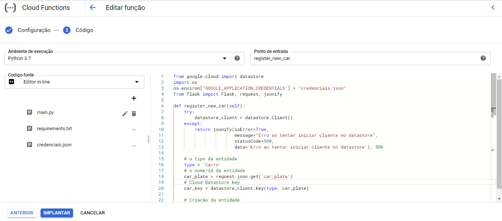
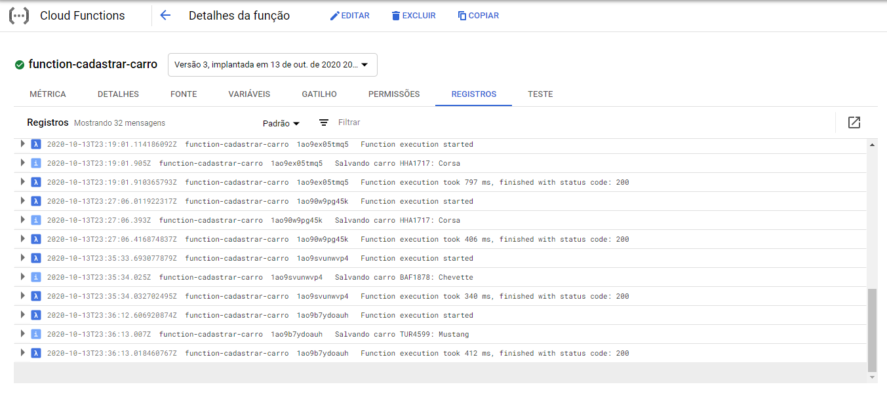
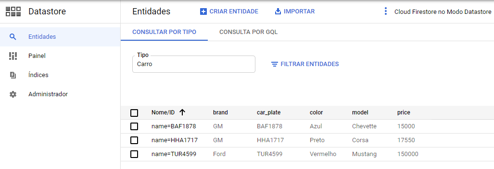

# Projeto Datastore
Aluno: Higor Férrer de Oliveira Leite 
Centro Universitário de Patos de Minas

## Sobre
O código contém as duas funções que foram criadas separadamente no Google Cloud Functions. Estão em formato de api flask local porque testei localmente antes de subir pro google.
### Rota para inserir carro
(Método *POST*) https://us-central1-datastore-projeto.cloudfunctions.net/function-cadastrar-carro

### Body da requisição de inserir carro
{
	"car_plate": "HHA1717",
	"color": "Preto",
	"price": "17550",
	"model": "Corsa",
	"brand": "GM"
}

### Response de sucesso
{
    "data": "Veículo cadastrado com sucesso",
    "isError": false,
    "message": "Success",
    "statusCode": 200
}

  
### Rota para buscar carro pela placa (JSON)
(Método *POST*) https://us-central1-datastore-projeto.cloudfunctions.net/get-carro

### Body da requisição de buscar carro pela placa (JSON)
{
	"car_plate": "HHA1717"
}

###Response de sucesso:
{
    "data": [
        {
            "brand": "GM",
            "car_plate": "HHA1717",
            "color": "Preto",
            "model": "Corsa",
            "price": "17550"
        }
    ],
    "isError": false,
    "message": "Dados Encontrados!",
    "statusCode": 200
}

  
### Prints
Código de uma das Functions

Logs

Registros no Datastore

